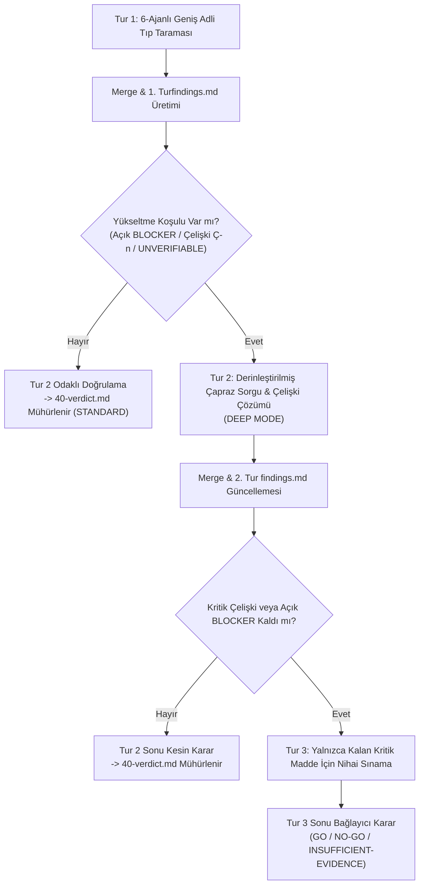

# Sherlock Birleştirme Kuralları (Merge & Adjudication Engine 3.0)

Bu dosya Lead Hakem Heyetine (orkestratör ana ajana) aittir.
Amaç: 6 uzman ajandan gelen raporları **özetlemek değil**, deterministik biçimde **tek bir bulgu defterine (`findings.md`) ve bağlayıcı nihai karara (`40-verdict.md`) indirgemektir**. Aynı girdilere uygulandığında her zaman aynı çıktıyı üretmelidir.

---

## 1. Algoritmik Birleştirme Adımları

### Adım 1 — Topla ve İndeksle
6 rapordan (`10-r1-structural.md`, `10-r1-literature.md`, `10-r1-adversary.md`, `10-r1-config.md`, `10-r1-test.md`, `15-r1-verification.md`) tüm bulguları `findings.md`'ye aktar.
- Verifier'ın `15-r1-verification.md` dosyasındaki damgasını `verification_status` alanına işle.
- Araştırmacının `epistemic_confidence` değerini koru.

### Adım 2 — Deduplikasyon (Tekilleştirme)
Aynı `(locus, claim)` çiftine işaret eden bulgular tek bir kanonik bulguda birleşir:
- **Kimlik:** En düşük numaralı veya birincil rolün kimliği korunur; diğerleri `corroborated-by:` listesine eklenir.
- **Şiddet (Severity):** Bulunan şiddetlerin en yükseği atanır.
- **Kanıt (Evidence):** Farklı açılardan sunulan tüm kanıtlar birleştirilerek saklanır.
- **Fix:** En minimal ve deterministik düzeltme seçilir; diğeri alternatif olarak not edilir.

### Adım 3 — Çoklu Ajan Destek Yükseltmesi (Corroboration Escalation)
Aynı kusuru **$\ge 2$ bağımsız uzman ajan** (`F-S`, `F-L`, `F-A`, `F-C`, `F-T`) bağımsız olarak tespit ettiyse:
- Şiddet bir kademe artırılır:
  `NIT → MINOR → MAJOR → BLOCKER` (Tavan: `BLOCKER`)
- *Not:* Aynı ajanın ürettiği birden fazla bulgu veya patron bulgusu (`F-B`) bağımsız destek sayılmaz.

### Adım 4 — `REFUTED` Bulguların İşlenmesi
- Verifier tarafından `REFUTED` damgası vurulan (somut karşı kanıtla çürütülen) bulgular aktif eylem planından (`20-plan.md`) çıkarılır.
- **Sessizce silinmez:** `40-verdict.md` dosyasındaki *"Reddedilen Bulgular ve Karşı Kanıtlar"* tablosuna gerekçesiyle kaydedilir.
- `REFUTED` bir bulguya bağımlı olan (`depends-on`) diğer bulguların dayanakları derhal yeniden değerlendirilir.

### Adım 5 — Gürültü Filtresi (Watchlist Routing)
Şu üç koşulu **birlikte** sağlayan bulgular eylem planından çıkarılarak *"İzleme Listesi (Watchlist)"*ne aktarılır:
1. `epistemic_confidence: SPECULATIVE` veya `verification_status: UNVERIFIABLE`, **ve**
2. Yalnızca tek bir ajan tarafından raporlandı (bağımsız destek yok), **ve**
3. `falsifier` alanı boş, belirsiz veya sınanamaz durumda.

### Adım 6 — Çelişki Defteri (Contradiction Ledger)
İki ajan birbiriyle çelişen iddialarda bulunuyorsa (`conflicts-with` bağı veya zıt tespitler):
- Hakem sessizce taraf tutamaz; bulguları `findings.md` içindeki Çelişki Defterine kaydeder:
  | # | İddia / Konu | Savunan | Karşı Çıkan | Çözüm İçin Gereken Somut Kanıt | Tur 2 Hakem Ataması |
  |---|---|---|---|---|---|
  | Ç-01 | X parametresi dinamik mi olmalı? | F-S2 | F-A1 | İlgili dosya runtime çalıştırılıp log incelenecek | `sherlock-structural` + `sherlock-verifier` |

### Adım 7 — Patron Bulguları (`F-B`)
Lead Hakem kendi bağımsız analizinden bir kusur eklerse:
- `F-B` önekiyle ve açıkça *"Patron Bulgusu"* etiketiyle yazar.
- Standart bulgu şemasına (`falsifier` dahil) tam uyar.
- Çoklu ajan destek yükseltmesinde bağımsız oy olarak sayılamaz.

---

## 2. Sıralama ve Önceliklendirme Matrisi

Bulgular eylem planına (`20-plan.md`) şu deterministik formülle dizilir:

1. **Öncelik Puanı ($P = \text{Severity} \times \text{Verification\_Status}$)** — `verification_status` enum'u: `CONFIRMED > PENDING_RECHECK > UNVERIFIABLE > REFUTED`. NOT: `epistemic_confidence` (CONFIRMED/PLAUSIBLE/SPECULATIVE) ayrı bir alandır; bu matrisin sütunu değildir:**

| Severity \ Verification Status | CONFIRMED | PENDING_RECHECK | UNVERIFIABLE | REFUTED |
|---|:---:|:---:|:---:|:---:|
| **BLOCKER** | **1 (Acil)** | **2** | **4** | → Kapat |
| **MAJOR** | **3** | **5** | **7** | → Kapat |
| **MINOR** | **6** | **8** | **9** | → Kapat |
| **NIT** | Ek Liste | Ek Liste | Ek Liste | → Kapat |

> *Örnek: `severity=BLOCKER, epistemic_confidence=PLAUSIBLE, verification_status=PENDING_RECHECK` → Priority **2** (BLOCKER satırı, PENDING_RECHECK sütunu). `REFUTED` bulgular L28-31 kuralına göre eylem planından çıkarılır.*

2. **Bağımlılık Sıralaması:** `depends-on` ilişkisi olan bulgularda öncül olan her zaman üst sıraya alınır.
3. **Çatışan Düzeltmeler:** Birbirinin fix'ini geçersiz kılan maddeler tek bir birleşik eylem iş paketinde (WP) toplanır.

---

## 3. Çok Turlu İlerleme ve Yükseltme Kriterleri (Multi-Round Convergence)

Her Sherlock denetimi en az 2 tur veya derinleşme durumunda azami 3 turda kesin karara bağlanır:

### Tur 2 Görev Dağıtım Kovaları:
Tur 2'de ajanlara *"her şeyi baştan tara"* denmez; yalnızca 3 hedefe odaklanılır:
- **(a) Açık Sorular:** Yalnızca o ajanın uzmanlığıyla çözülebilecek gri alanlar.
- **(b) İtirazlar & Savunma:** Ajanın 1. Tur bulgularına gelen itirazlar ve düşürülen damgalar.
- **(c) Hakemlik:** Atandığı Çelişki Defteri satırları (`Ç-01..Ç-n`).
- *Adversary Özel Görevi:* 1. Turda üretilen `20-plan.md` çözüm planının kendisine saldırarak yeni arıza rotaları arar.

---

## 4. Nihai Karar Tablosu (Verdict Rules)

| Karar Damgası | Koşul | Eylem |
|---|---|---|
| **`GO`** | Açık `BLOCKER` yok, doğrulanmış açık `MAJOR` yok. | Değişiklik/plan güvenle onaylanır ve yürütülür. |
| **`GO-WITH-CONDITIONS`** | Açık `BLOCKER` yok; `MAJOR` bulgular **numaralı, ölçülebilir ve test edilebilir** ön koşullarla kapatılabiliyor. | Koşullar eylem planına bağlayıcı kural olarak eklenir. |
| **`NO-GO`** | En az bir doğrulanmış (`CONFIRMED`) `BLOCKER` var ve koşulla kapatılamıyor. | Süreç derhal durdurulur; güvenli geri alma (`rollback`) işletilir. |
| **`INSUFFICIENT-EVIDENCE`** | Kararı doğrudan belirleyen kritik soru(lar) `UNVERIFIABLE` kaldı veya çözülememiş `BLOCKER/MAJOR` çelişkisi var. | Eksik kanıtlar tamamlanmadan ilerlenemez. |

*Zorunlu Madde:* `40-verdict.md` dosyasında **"Neyi İncelemedik (Out-of-Scope / Unaudited)"** ve **"Taviz Verilmeyen Riskler"** bölümleri istisnasız yer almak zorundadır.
